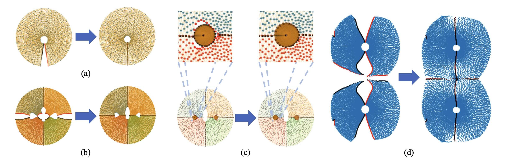
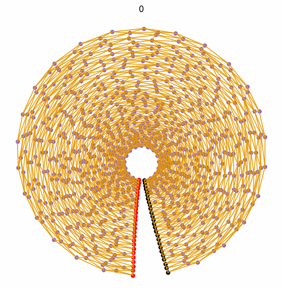
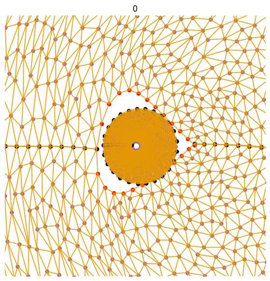
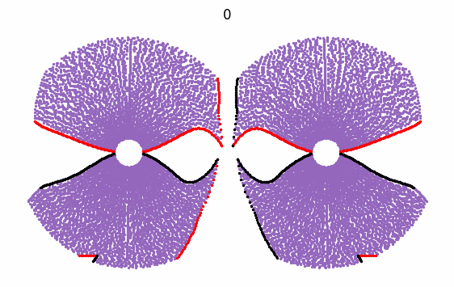

# Physically Realizable Natural-looking Clothing Textures Evade Person Detectors via 3D Modeling (Supplementary Method)
[Here](https://github.com/WhoTHU/Adversarial_camou) is the main repo.

# Zipping method for processing meshes

This is the official supplementory repository for the paper [Physically Realizable Natural-looking Clothing Textures Evade Person Detectors via 3D Modeling](https://openaccess.thecvf.com/content/CVPR2023/html/Hu_Physically_Realizable_Natural-Looking_Clothing_Textures_Evade_Person_Detectors_via_3D_CVPR_2023_paper.html).

Zipping is a continuous transformation from **geometrically plausible projection (GeoProj)** to **topologically plausible projection (TopoProj)** inspired by physical mechanisms of elastic stress.

<p align="center">
  
</p>

<div style="text-align: center;">
  
  
  
</div>

<!-- toc -->
#### 1. Requirements
All the codes are tested in the following environment:
* Linux (Ubuntu 16.04.6)
* Python 3.8.13
* CUDA 11.0
* PyTorch 1.10.1
* Numpy 1.22.3
* Torchvision 0.11.2
* pytorch3d 0.6.2
* TensorboardX 2.5.1
* Jupyterlab 3.3.2
* Tqdm 4.64.0
* Easydict 1.9

#### 2. Run
Please see
```
demo.ipynb
```
Tips: For new objs, the users need to
##### (1) Find different pieces in the obj files.
##### (2) Choose a process sequence for the combination of different pieces.
##### (3) Customize their initial functions.